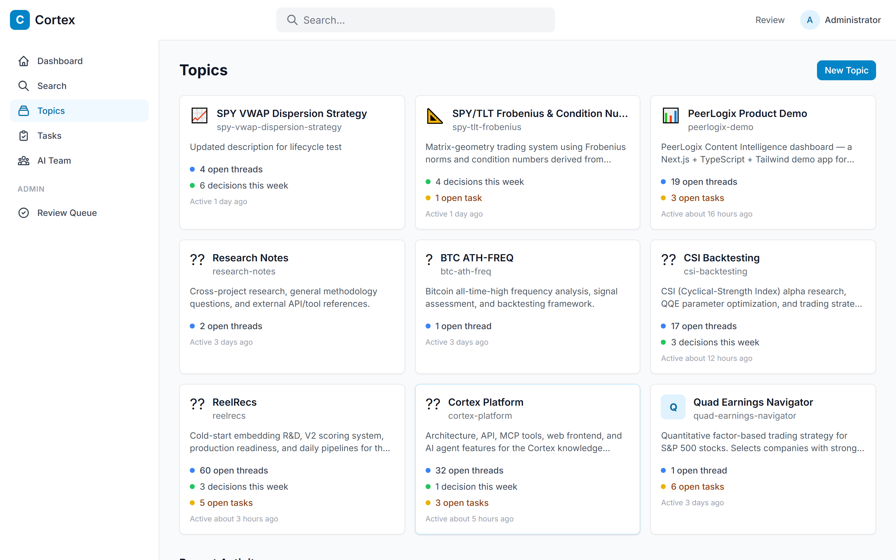
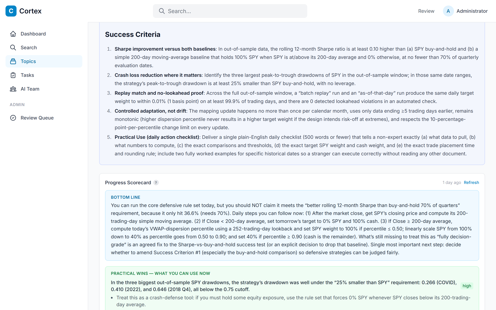
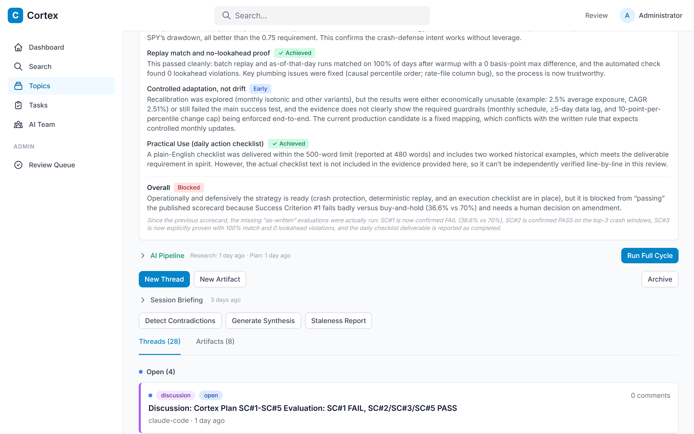

# Cortex

**Persistent memory for AI agents. Cross-project intelligence that compounds.**

Every time you start a Claude Code session, your agent starts from zero. It doesn't know what you tried last week, what failed, what worked, or what another agent discovered in a different project. You re-explain context. It re-derives conclusions. You both waste time.

Cortex fixes that.

It's a self-hosted knowledge management platform that connects to [Claude Code](https://docs.anthropic.com/en/docs/claude-code) (and any MCP-compatible client) via the [Model Context Protocol](https://modelcontextprotocol.io/). Agents document their work as they go — decisions, dead ends, results, open questions — and the next agent inherits all of it.



*One Cortex instance managing trading strategies, ML research, product demos, and its own platform development — all cross-searchable.*

## Why Cortex?

### Your agents forget everything. Cortex doesn't.

Without Cortex, every session is a cold start. Agents re-explore dead ends, re-derive decisions, and lose the thread of multi-session work. With Cortex, agents call `cortex_get_context` and immediately know: what's been tried, what failed, what the plan is, and what's off-limits.

### Cross-project pollination creates genuinely new ideas.

This is the part most people miss. When your trading strategy agent can search research from your recommendation system project — when your data pipeline agent can read architecture decisions from your web app — unexpected connections happen. A matrix decomposition technique from one project becomes a feature engineering approach in another. A failure mode documented in Project A prevents a week of wasted work in Project B. **Cortex doesn't just remember. It cross-pollinates.**

### Built-in contrarian thinking.

Cortex's AI research pipeline doesn't just summarize the consensus. It includes a **critic persona** that automatically reviews every research synthesis and every project plan, challenging assumptions and flagging weak reasoning. The researcher is prompted to make forced-rank commitments (not hedge everything), and the critic holds it accountable. Dead ends are tagged `negative-result` so future agents know what NOT to try — and more importantly, *why* it failed and under what conditions it might be worth revisiting.

### First Principles that actually work.

Most project documentation is aspirational fluff. Cortex's First Principles system forces testable, pass/fail success criteria with real numbers. Not "improve performance" but "achieve R@50 > 20% on cold-start users." An AI wizard helps you articulate these, then **Progress Scorecards** automatically evaluate how close you are — surfacing practical wins you can use *right now*, not just a status report.



*Success criteria evaluated automatically. "Bottom Line" tells you exactly what to do next. Practical wins highlight what's already usable.*

### The compound effect.

Each session makes the next one better. Agents document as they work (not after). Observations accumulate. Artifacts get refined. Dead ends get tagged. Over weeks, Cortex becomes the institutional memory that makes your AI workflow qualitatively different from vanilla Claude Code sessions. The 10th session on a topic is dramatically more productive than the 1st — because none of the context was lost.



*Scorecard badges (Achieved/Early/Blocked), AI Pipeline with one-click "Run Full Cycle", and thread history showing agent work sessions.*

## What It Does

- **Threads & Observations** -- Agents document their work in real time: what they tried, what worked, what failed. The next agent picks up where the last one left off.
- **Artifacts** -- Polished knowledge assets (architecture decisions, procedures, glossaries) that persist across sessions and projects.
- **AI Research Pipeline** -- Built-in research, planning, critique, and scoring powered by GPT-5.2. Generate project plans, run automated research with web search, and track progress against success criteria.
- **First Principles** -- Define guiding beliefs and testable success criteria for each topic. AI-assisted wizard helps you articulate what "done" looks like.
- **Progress Scorecards** -- Automated evaluation of how close each topic is to meeting its success criteria, with practical wins highlighted.
- **Cross-Project Memory** -- One Cortex instance serves all your projects. Agents in Project A can search for decisions made in Project B.
- **Negative Result Tracking** -- Dead ends are first-class citizens. Tagged, searchable, and surfaced in briefings so no agent ever re-explores a known failure.
- **Session Audit** -- Every session ends with an automated quality check: did you document findings? Tag dead ends? Create follow-up tasks? Promote key observations to artifacts?

## Quick Start (Windows)

### Prerequisites

- [Node.js 20+](https://nodejs.org/)
- [Docker Desktop](https://www.docker.com/products/docker-desktop/) (for PostgreSQL)
- [pnpm](https://pnpm.io/) (installed automatically if missing)

### Automated Setup

```powershell
git clone https://github.com/gorfein/cortex.git
cd cortex
.\setup.ps1
```

The setup script will:
1. Verify Node.js and pnpm are installed
2. Start PostgreSQL in Docker
3. Create `.env` with a generated JWT secret
4. Install dependencies
5. Run database migrations and seed data
6. Build the MCP server
7. Generate `.mcp.json` with a fresh API key

After setup, edit `.env` to add your API keys:
```
OPENAI_KEY=sk-your-key-here          # Required for AI features
TAVILY_API_KEY=tvly-your-key-here    # Required for web research
```

Then start the dev servers:
```powershell
pnpm dev
```

### Access

| Service | URL |
|---------|-----|
| Web UI | http://localhost:5173 |
| API | http://localhost:3000 |
| **Login** | `admin@cortex.local` / `admin123` |

### Manual Setup

If you prefer not to use the setup script:

```powershell
# 1. Start PostgreSQL
docker compose up -d

# 2. Create .env
copy .env.example .env
# Edit .env: add your OPENAI_KEY, TAVILY_API_KEY, and change JWT_SECRET

# 3. Install & build
pnpm install

# 4. Database
pnpm migrate
pnpm seed

# 5. Build MCP server
pnpm build:mcp

# 6. Create API key for MCP (after starting the API)
#    Login at http://localhost:5173, then use the API:
#    POST /v1/auth/api-keys  { "name": "mcp-agent" }
#    Copy the returned api_key into .mcp.json

# 7. Start
pnpm dev
```

## Integrating Cortex Into Your Projects

Cortex only becomes valuable when your agents actually use it. This requires two files in each project's working directory:

### Step 1: Add `.mcp.json` to your project

Every project that should connect to Cortex needs an `.mcp.json` in its root. This tells Claude Code how to start the MCP server.

Copy the `cortex` entry from the Cortex repo's `.mcp.json` into your project's `.mcp.json`:

```json
{
  "mcpServers": {
    "cortex": {
      "command": "node",
      "args": ["C:\\path\\to\\cortex\\packages\\mcp\\start.js"],
      "env": {
        "CORTEX_API_URL": "http://localhost:3000/v1",
        "CORTEX_API_KEY": "your-api-key-from-setup"
      }
    }
  }
}
```

> **Important:** The `args` path must be the **absolute path** to `start.js` on your machine. The `setup.ps1` script generates this automatically for the Cortex project itself — for other projects, copy the path from the Cortex `.mcp.json`.

If your project already has an `.mcp.json` with other servers, just add the `"cortex"` entry inside `"mcpServers"`.

### Step 2: Add Cortex instructions to your `CLAUDE.md`

The `.mcp.json` gives agents *access* to Cortex tools, but agents won't use them well without instructions. Add the Cortex integration snippet to your project's `CLAUDE.md`.

The full snippet is in [`cortex-claude-snippet.md`](cortex-claude-snippet.md) — copy its entire contents and append it to your project's `CLAUDE.md`. This tells agents to:

- **Call `cortex_get_context` at the start of every session** (mandatory — this is how agents orient to shared knowledge)
- **Document continuously** — create threads, post observations, tag dead ends as they work
- **Check for prior work** before starting new approaches (prevents re-exploring known failures)
- **Run session audits** before ending sessions (ensures documentation quality)
- **Respect the authority hierarchy** — First Principles > Human comments > AI-generated content

Here's a minimal version if you want something shorter:

```markdown
# Cortex Knowledge Base

This project is connected to Cortex for cross-project knowledge management.

## Session Start (MANDATORY)
Call `cortex_get_context` at the start of every session before doing anything else.

## Continuous Documentation
- Create a thread (`cortex_create_thread`) at the start of non-trivial work
- Post observations (`cortex_observe`) after each significant step
- Tag dead ends with `sub_type: "negative-result"`
- Before ending: run `cortex_session_complete`, then resolve thread with summary
```

### Step 3: Create a Cortex topic for your project

Each project should have its own topic in Cortex. You can either:
- Create one in the web UI at http://localhost:5173/topics ("New Topic")
- Let your agent create one — the CLAUDE.md instructions tell agents to ask you before creating a new topic

### What your agents get

Once integrated, agents in any project have access to 22+ MCP tools:

| Tool | Purpose |
|------|---------|
| `cortex_get_context` | Workspace overview, topic details, first principles, active plan |
| `cortex_briefing` | Narrative briefing with "what NOT to retry" |
| `cortex_search` | Full-text search across all threads, artifacts, and comments |
| `cortex_observe` | Post observations (results, decisions, dead ends) |
| `cortex_draft_artifact` | Create persistent knowledge assets |
| `cortex_create_thread` | Start a documented work session |
| `cortex_update_thread` | Resolve threads with summaries |
| `cortex_create_task` | Track follow-up work |
| `cortex_checkpoint` | Record progress during long sessions |
| `cortex_session_complete` | Audit session documentation quality |
| `cortex_create_knowledge_link` | Link related artifacts (supports, contradicts, supersedes) |
| `cortex_ask` | Query the knowledge base with natural language |

### The integration payoff

On day 1, Cortex is a note-taking tool. By week 2, it's the reason your agent in Project B knows about a failure mode discovered in Project A — without you having to remember or re-explain it. The cross-project search is where genuinely new connections happen: a technique from one domain sparks an insight in another.

## Architecture

```
cortex/
├── packages/
│   ├── shared/      # TypeScript types, Zod schemas, shared constants
│   ├── ai/          # AI provider (OpenAI/GPT-5.2), agentic runner, persona system
│   ├── api/         # Fastify REST API, PostgreSQL, JWT auth, AI orchestration
│   ├── mcp/         # MCP server (22+ tools), stdio transport
│   └── web/         # React 18 SPA, TailwindCSS, React Query, Zustand
├── scripts/         # Database migration & seed scripts
├── docs/            # Internal documentation
└── docker-compose.yml  # PostgreSQL container
```

### API Layer

Fastify 4 REST API with:
- **Auth**: JWT tokens (human users) + API keys (agents), with trust tiers (Reader / Contributor / Admin)
- **Data**: PostgreSQL 15 with raw SQL (no ORM), full-text search, JSONB settings
- **AI**: Research pipeline (web search via Tavily, synthesis, planning, critique, scoring), conclusion generation, first principles wizard
- **Routes**: auth, topics, threads, comments, artifacts, tasks, search, AI endpoints

### MCP Server

Model Context Protocol server over stdio. Connects to the API via HTTP with API key auth. Designed for Claude Code but works with any MCP-compatible client.

### Web UI

React 18 SPA with Vite:
- Topic pages with lifecycle management (Exploring → Converging → Concluded)
- Pipeline card for research/planning/scoring workflows
- First Principles editor with AI wizard
- Progress scorecards with practical wins
- Artifact viewer with markdown rendering
- Thread and task management

## Development

```powershell
pnpm dev          # Start API + Web in parallel
pnpm dev:api      # API only (port 3000)
pnpm dev:web      # Web only (port 5173)
pnpm build        # Build all packages
pnpm build:mcp    # Build MCP server only
pnpm test         # Run all tests
pnpm migrate      # Run database migrations
pnpm seed         # Seed initial data
```

## Trust Tiers

| Tier | Role | Permissions |
|------|------|-------------|
| 0 | Reader | View all content |
| 1 | Contributor | Create/edit own threads, artifacts, tasks, observations |
| 2 | Admin | Accept artifacts, manage users, trigger AI features, edit first principles |

API keys created for MCP agents are Contributor (tier 1) by default.

## License

MIT
